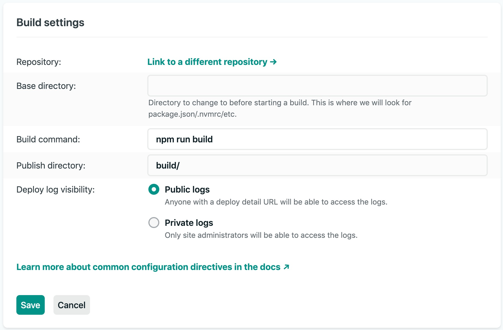
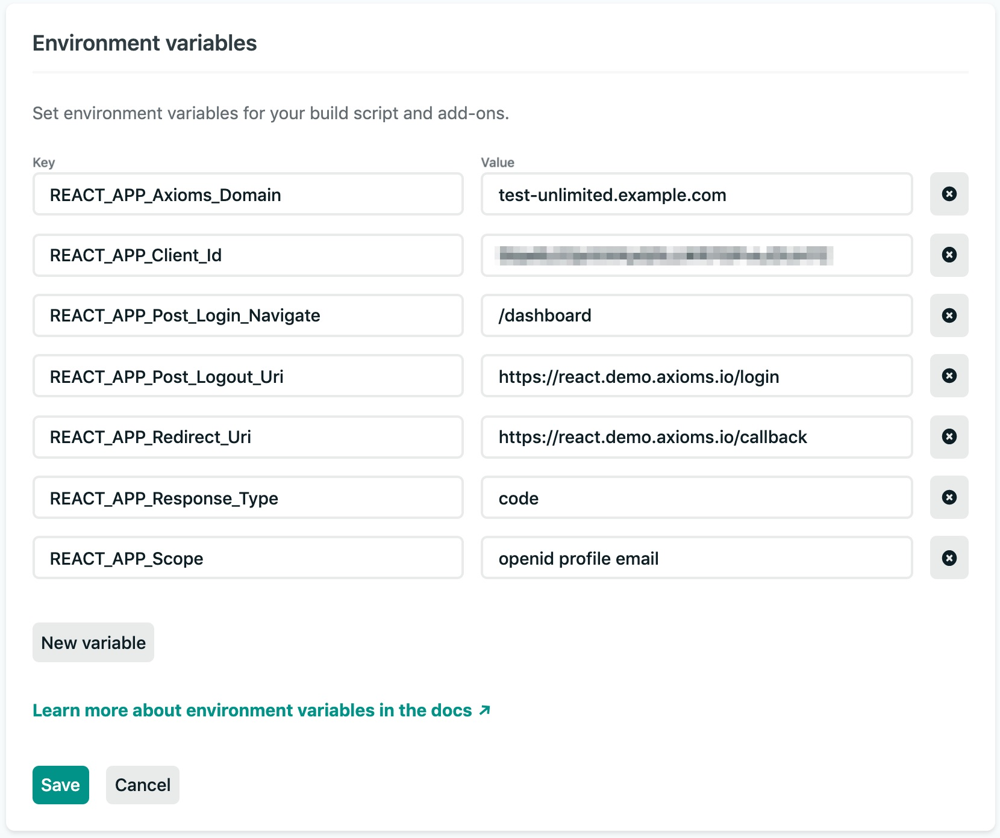

# sample-react
React sample with [Axioms](https://axioms.io) authentication using `web-js` SDK.


## Clone or download this repo
```
git clone git@github.com:axioms-io/sample-react.git
cd sample-react
```

Make sure to update the origin.

```
git remote set-url origin new.git.url/here
```

## Install dependencies
```
npm install
```

## Update config
Either update `.env.production` or create a `.env.local` to add following configs. If you are using Netlify for deployment and build you can use their environment variables (see Netlify details at the end).

- `Your-App-Host` is where you going to host or run your app. It can be `localhost` or a domain
- `Your-Client-ID` is your client id which can be obtained from the Axioms Dashboard -> Clients section
- `Your-Axioms-Domain` is your Axioms tenant default domain or custom domain mapped to Axioms servers

```
REACT_APP_Client_Id=<Your-Client-ID>
REACT_APP_Axioms_Domain=<Your-Axioms-Domain>
REACT_APP_Redirect_Uri=https://<Your-App-Host>/callback
REACT_APP_Post_Logout_Uri=https://<Your-App-Host>/login
REACT_APP_Response_Type=<Your-Response-Type>
REACT_APP_Scope=<Your-Scope>
REACT_APP_Post_Login_Navigate=<Your-Post-Login-Navigate>
```

We recommend to use `code` response type (Authorization code flow with PKCE). For more supported response type options please review  `web-js` [documentation](https://developer.axioms.io/docs/sdks-samples/use-with-spas/web-js).

Here is an example version of `.env.local`

```js  title=".env.local"
REACT_APP_Client_Id=MvnGPGwPJ7DNs0fQLpAr4dhi2PbfuQX1
REACT_APP_Axioms_Domain=auth.test-unlimited.com
REACT_APP_Redirect_Uri=http://localhost:3000/callback
REACT_APP_Post_Logout_Uri=http://localhost:3000/login
REACT_APP_Response_Type=code
REACT_APP_Scope=openid profile email
REACT_APP_Post_Login_Navigate=/dashboard
```

### Compile and hot-reload for local development
```
npm start
```

### Compile and minify for production

Build using `.env.production`

```
npm run build
```

## Build and deploy to Netlify

Simply click following button and provide your `.env` variables,

<a href="https://app.netlify.com/start/deploy?repository=https://github.com/axioms-io/sample-react"></a>

**OR**

1. Fork this repository and connect your Github project in Netlify.

2. Configure your build command and output directory and you are good to go.


### Build Settings
Build command: `npm run build`

Publish directory: `build/`



### Environment Settings
